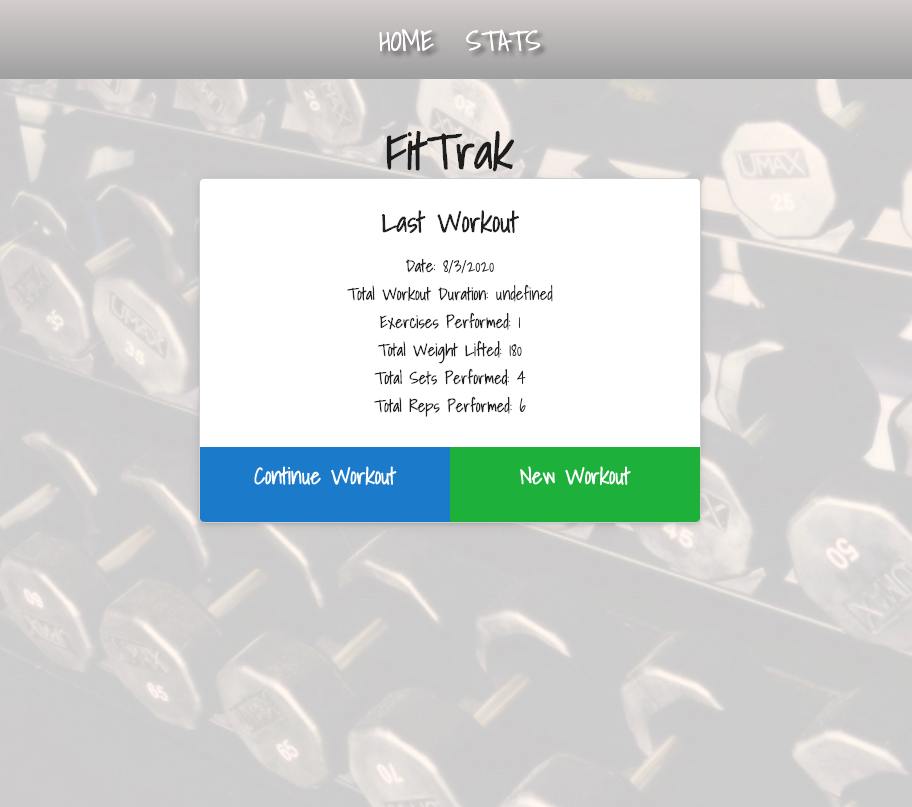
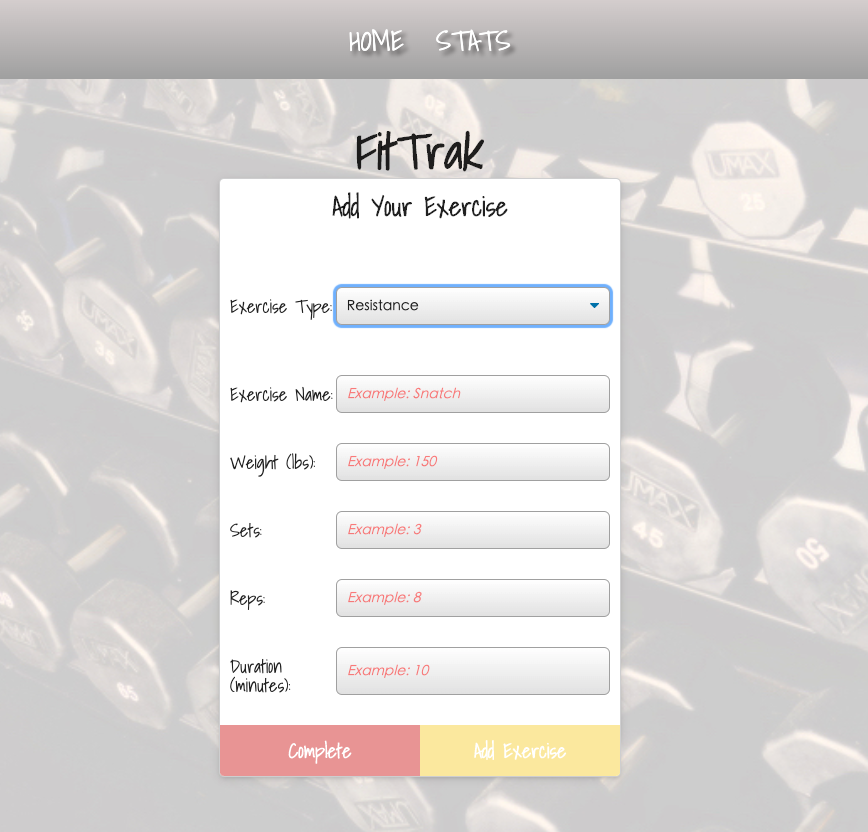
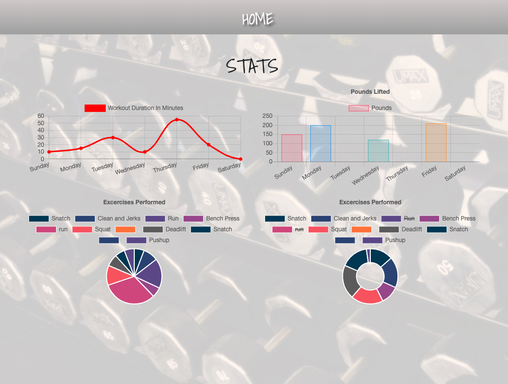

 # Project Name  
  FitTrak

  ## Overview 
  Reach your fitness goals quicker with FitTrak!! Create and track daily workouts and log multiple exercises in a workout on a given day which stores your info using MongoDB. Track the name, type, weight, sets, reps, and duration of exercise. If the exercise is cardio, no sweat!!...track the distance traveled.  You're on the right FitTrak! 

  ## Table of Contents:
  - [Links](#Links)
  - [GIFs](#GIFs)
  - [Motivation](#Motivation)
  - [Installation](#Installation)
  - [How to use](#How_to_use)
  - [Benefit](#Benefit)
  - [Screenshots](#Screenshots)
  - [Tests](#Tests)
  - [License](#License)
  - [Contribute](#Contribute)

  ## Links
  - [Video](https://drive.google.com/file/d/1IjnHgv2WOny1pHBLBSynCb7MhYCyWxOp/view) of the deployed project through Google Drive (download to view vid).
  - [Heroku](https://fit-trak.herokuapp.com/) to use the app.
  - [GitHub Pages](https://jmeggles.github.io/17_FitTrak/) to view README.
  - [GitHub Repo](https://github.com/jmeggles/17_FitTrak) to view the code.

 ## GIFs 
  - 
  - 

  
  ## Motivation
  Trackers help people keep info for reference.  Fitness trackers help the same and is an essential tool in weight loss, muscle building, or overall health in general. I know how just useful trackers are.  Spending many years in bodybuilding, I needed to stay on track and keep logs of my progress.  This app is an easy to navigate simple tracker to log workouts weather it's weight training or cardiovascular.  FitTrak will keep you on track!  

  ## Installation  
  No installation needed.  Open with this link [Heroku](https://fit-trak.herokuapp.com/).

  ## How_to_use
  - Follow link to deploy app and click on "New Workout" to log first exercise.  
  - Select "Resistance" or "Cardio" from the drop down menu then enter required information the spots below.  
  - Click on "Stats" in the navigation bar above to view all workouts.

  ## Benefit
  Anyone who needs to help keeping logs of workouts.  The best way to make progress is to keep detailed logs for reference.  

  ## Credits
  John Dinsmore, Jorge Alvarez, & Ben Benson with *WebDev Tutoring*

  ## Tests
  Console logs were used along the way.  However, there is one known bug.  The Total Duration is still not functioning proeperly on the home screen and will be updated ASAP.  

  ## Screenshots
  To view complete video of FitTrak please visit Google Drive [here](https://drive.google.com/file/d/1IjnHgv2WOny1pHBLBSynCb7MhYCyWxOp/view) and click download.
    -   
    - 
    -   

 
  ## License 
  [MIT License](https://opensource.org/licenses/MIT)
  
  Copyright © 2020 Jody Eggleston 

  ## Contribute
  For comments and/or questions, contact Jody Eggleston via 
  [Linkedin](https://www.linkedin.com/in/jody-eggleston/)

  